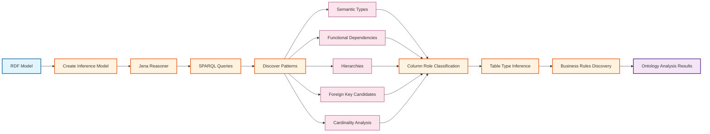
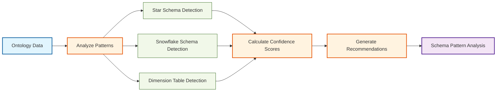
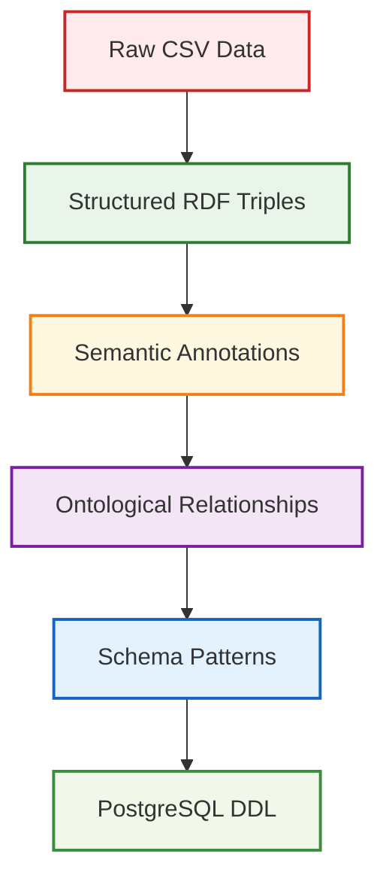

# PG Semantic Schema Pipeline Flow

## Complete Pipeline Overview

```mermaid
flowchart TD
    %% Input
    A[CSV File] --> B[Pipeline Entry Point]
    
    %% Stage 1: CSV to RDF Conversion
    B --> C[CSV to RDF Conversion]
    C --> C1[Parse CSV Data]
    C1 --> C2[Analyze Columns]
    C2 --> C3[Detect Semantic Types]
    C3 --> C4[Create RDF Triples]
    C4 --> C5[RDF Model with Metadata]
    
    %% Stage 2: Ontology Discovery
    C5 --> D[Ontology Discovery]
    D --> D1[Create Inference Model]
    D1 --> D2[Discover Semantic Types]
    D2 --> D3[Find Functional Dependencies]
    D3 --> D4[Detect Hierarchies]
    D4 --> D5[Identify Foreign Key Candidates]
    D5 --> D6[Analyze Cardinality]
    D6 --> D7[Classify Column Roles]
    D7 --> D8[Infer Table Type]
    D8 --> D9[Discover Business Rules]
    D9 --> D10[Ontology Analysis Results]
    
    %% Stage 3: Schema Pattern Discovery
    D10 --> E[Schema Pattern Discovery]
    E --> E1[Analyze Dimension Hierarchies]
    E1 --> E2[Identify Fact Table Structure]
    E2 --> E3[Identify Dimension Table Structure]
    E3 --> E4[Calculate Pattern Confidence]
    E4 --> E5[Generate Recommendations]
    E5 --> E6[Schema Pattern Analysis]
    
    %% Stage 4: Intelligent Naming
    D10 --> F[Intelligent Naming]
    F --> F1[Detect Business Domain]
    F1 --> F2[Classify Table Purpose]
    F2 --> F3[Extract Key Concepts]
    F3 --> F4[Generate Schema Name]
    F4 --> F5[Generate Table Name]
    F5 --> F6[Suggest Column Names]
    F6 --> F7[Intelligent Names]
    
    %% Stage 5: SQL Generation
    E6 --> G[SQL DDL Generation]
    F7 --> G
    G --> G1[Map Semantic Types to PostgreSQL Types]
    G1 --> G2[Generate Column Definitions]
    G2 --> G3[Create Fact Table DDL]
    G3 --> G4[Create Dimension Table DDL]
    G4 --> G5[Generate Indexes]
    G5 --> G6[Add Constraints]
    G6 --> G7[Create Comments]
    G7 --> G8[Final DDL Statements]
    
    %% Output
    G8 --> H[PostgreSQL Schema File]
    
    %% Data Flow Styling
    A:::input
    H:::output
    C5:::data
    D10:::data
    E6:::data
    F7:::data
    G8:::data
    
    %% Process Styling
    C:::process
    D:::process
    E:::process
    F:::process
    G:::process
    
    %% Sub-process Styling
    C1:::subprocess
    C2:::subprocess
    C3:::subprocess
    C4:::subprocess
    D1:::subprocess
    D2:::subprocess
    D3:::subprocess
    D4:::subprocess
    D5:::subprocess
    D6:::subprocess
    D7:::subprocess
    D8:::subprocess
    D9:::subprocess
    E1:::subprocess
    E2:::subprocess
    E3:::subprocess
    E4:::subprocess
    E5:::subprocess
    F1:::subprocess
    F2:::subprocess
    F3:::subprocess
    F4:::subprocess
    F5:::subprocess
    F6:::subprocess
    G1:::subprocess
    G2:::subprocess
    G3:::subprocess
    G4:::subprocess
    G5:::subprocess
    G6:::subprocess
    G7:::subprocess
    
    %% Styling Classes
    classDef input fill:#e1f5fe,stroke:#01579b,stroke-width:2px
    classDef output fill:#f3e5f5,stroke:#4a148c,stroke-width:2px
    classDef process fill:#fff3e0,stroke:#e65100,stroke-width:2px
    classDef subprocess fill:#f1f8e9,stroke:#33691e,stroke-width:1px
    classDef data fill:#fce4ec,stroke:#880e4f,stroke-width:1px
```

## Detailed Stage Breakdown

### Stage 1: CSV to RDF Conversion

```mermaid
flowchart LR
    A[CSV File] --> B[Parse CSV]
    B --> C[Extract Headers & Data]
    C --> D[Transpose Data by Column]
    D --> E[Analyze Each Column]
    E --> F[Detect Semantic Types]
    F --> G[Calculate Statistics]
    G --> H[Create RDF Model]
    H --> I[Add Column Metadata]
    I --> J[Add Row Data as Triples]
    J --> K[Detect Relationships]
    K --> L[RDF Model with Semantic Annotations]
    
    A:::input
    L:::output
    B:::process
    C:::process
    D:::process
    E:::process
    F:::process
    G:::process
    H:::process
    I:::process
    J:::process
    K:::process
    
    classDef input fill:#e1f5fe,stroke:#01579b,stroke-width:2px
    classDef output fill:#f3e5f5,stroke:#4a148c,stroke-width:2px
    classDef process fill:#fff3e0,stroke:#e65100,stroke-width:2px
```

### Stage 2: Ontology Discovery

### Stage 3: Schema Pattern Discovery

### Stage 4: SQL Generation

```mermaid
flowchart LR
    A[Schema Analysis] --> B[Map Data Types]
    B --> C[Generate Column Definitions]
    C --> D[Create Table DDL]
    D --> E[Add Constraints]
    E --> F[Generate Indexes]
    F --> G[Add Comments]
    G --> H[Final DDL Statements]
    
    A:::input
    H:::output
    B:::process
    C:::process
    D:::process
    E:::process
    F:::process
    G:::process
    
    classDef input fill:#e1f5fe,stroke:#01579b,stroke-width:2px
    classDef output fill:#f3e5f5,stroke:#4a148c,stroke-width:2px
    classDef process fill:#fff3e0,stroke:#e65100,stroke-width:2px
```

## Data Transformation Flow

## Key Components and Their Roles

### Core Namespaces
- **`core.clj`** - Main pipeline orchestration
- **`rdf-conversion.clj`** - CSV to RDF conversion with semantic type detection
- **`ontology-discovery.clj`** - Semantic pattern discovery using Jena reasoners
- **`schema-discovery.clj`** - Star/snowflake schema pattern detection
- **`sql-generation.clj`** - PostgreSQL DDL generation
- **`naming.clj`** - Intelligent naming strategies
- **`config.clj`** - Configuration and Jena setup
- **`utils.clj`** - Advanced semantic type detection utilities

### Key Technologies
- **Apache Jena** - RDF processing and reasoning
- **SPARQL** - Semantic query language for pattern discovery
- **Clojure** - Functional programming for data transformation
- **PostgreSQL** - Target database system

### Output Artifacts
- **RDF Model** - Semantic representation of data
- **Ontology Analysis** - Discovered relationships and patterns
- **Schema Recommendations** - Star/snowflake pattern suggestions
- **PostgreSQL DDL** - Complete database schema with constraints and indexes 